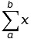

### PROBLEM 1: FizzBuzz, basically

> If we list all the natural numbers below 10 that are multiples of 3 or 5, we get 3, 5, 6 and 9. The sum of these multiples is 23.
> Find the sum of all the multiples of 3 or 5 below 1000.

Naive solution: just loop through from 1 to 1000, and add each multiple of 3 or 5 to a running total. An easy way to check if a number, n, is a multiple of m,
is whether n % m is 0;

```javascript
function sumMultiplesOf3And5() {
  var sum = 0;
  for (var i = 0; i < 1000; i++) {
    if (i % 3 === 0 || i % 5 === 0) sum += i;
  }
  return sum;
}
```

But what is the time complexity? Let's vary `1000` as the input and make it arbitrarily large.

<p align="center">
  
</p>

This is a linear time solution, `O(n)`.

Let's see if we can do better

Math Solution:
<p align="center">
  
</p>
If we take the equation for an arithmetic series: 
<p align="center">
  
</p>

Then we can reduce the above equation to:

<p align="center">
  
</p>
Reduce, and our answer is
> 233168

If we try our input with larger numbers we get:

| Input         | Time (ms)     |
| ------------- |:-------------:|
| 1e+5          | 0             |
| 1e+6          | 0             |
| 1e+7          | 0             |
| 1e+8          | 0             |
| 1e+9          | 0             |
| 1e+10         | 0             |
| 1e+11         | 0             |

The algorithm takes less than 1 ms, and does not increase with input size. There's no point in plotting a flat line at 0, but it's clear this algorithm is constant time, `O(1)`.

