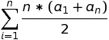

### PROBLEM 1: FizzBuzz, basically

> If we list all the natural numbers below 10 that are multiples of 3 or 5, we get 3, 5, 6 and 9. The sum of these multiples is 23.
> Find the sum of all the multiples of 3 or 5 below 1000.

This is the first problem on Project Euler, and naturally it's pretty easy. Actually, it's really just a permutation of FizzBuzz. I'm going to use this problem, however, to demonstrate how I'll analyze time complexity going forward. I'll do this problem two ways: using the obvious naive solution in `O(n)` time, and then a more elegant math solution in `O(1)` time. I've found most Project Euler problems can be solved this way: a straightforward but slow algorithm or a more difficult, fast algorithm

Naive solution: just loop through from 1 to 1000, and add each multiple of 3 or 5 to a running total. An easy way to check if a number, `n`, is a multiple of `m`,
is whether `n % m is 0`.

```javascript
function sumMultiplesOf3And5(n) {
  var sum = 0;
  for (var i = 0; i < n; i++) {
    if (i % 3 === 0 || i % 5 === 0) sum += i;
  }
  return sum;
}
```

Our solution is, `sumMultiplesOf3And5(1000)`:

> 233168

But what's  the time complexity? Let's vary `1000` as the input and make it arbitrarily large. Below is a graph of the input to `sumMultiplesOf3and5`, `n` vs the time in miliseconds the algorithm takes to complete.

<p align="center">
  
</p>

This is clearly a linear time solution. To make this chart, I used Chart.js and sampled the running time of this algorithm for a variety of inputs. To see the code, check my Github Repo. 

Let's see if we can do better:

Math Solution:

If we take the equation for an arithmetic series: 
<p align="center">
  
</p>

Then for `n = 1000`, we can reduce the equation to the arithmetic series of multiples of 3 and multiples of 5 minus multiples of 15 up to 1000. We subtract the multiples of 15 to avoid double counting multiples of 3 AND 5.

<p align="center">
  
</p>

We can write this more generally for any `n`:

```javascript
function arithSeries(start, end, diff) {
	return ((start + end)/2) * ((end - start)/diff + 1);
}
function multiplesOf3And5_2(n) {
  return arithSeries(3,Math.floor((n - 1) / 3) * 3,3) + arithSeries(5,Math.floor((n - 1) / 5) * 5,5) - arithSeries(15,Math.floor((n - 1) / 15) * 15,15);
}
```


If we try our input with larger numbers we get:

| Input         | Time (ms)     |
| ------------- |:-------------:|
| 1e+5          | 0             |
| 1e+6          | 0             |
| 1e+7          | 0             |
| 1e+8          | 0             |
| 1e+9          | 0             |
| 1e+10         | 0             |
| 1e+11         | 0             |

It's unfortunate, but Javascript does not provide sub-millisecond level time. You could time it at the systems level and get microsecond timing (although this is notoriously innaccurate), but I wanted my code to work for everyone independent of which system they were on, so I use Javascript's builtin `Date` functionality. As you can see, the algorithm takes less than 1 ms, and does not increase with input size. It'd be nice if we could see a value other than 0 here for the "constant" time, but it's clear this algorithm has `O(1)` runtime.

Going forward, this will be the way I'll analyze time complexity for each problem. (1) abstractly analyze the time complexity, (2) sample the completion time of the algorithm for a variety of inputs and (3) either chart the data or list the table of values to confirm that my abstract reasoning was correct. 
